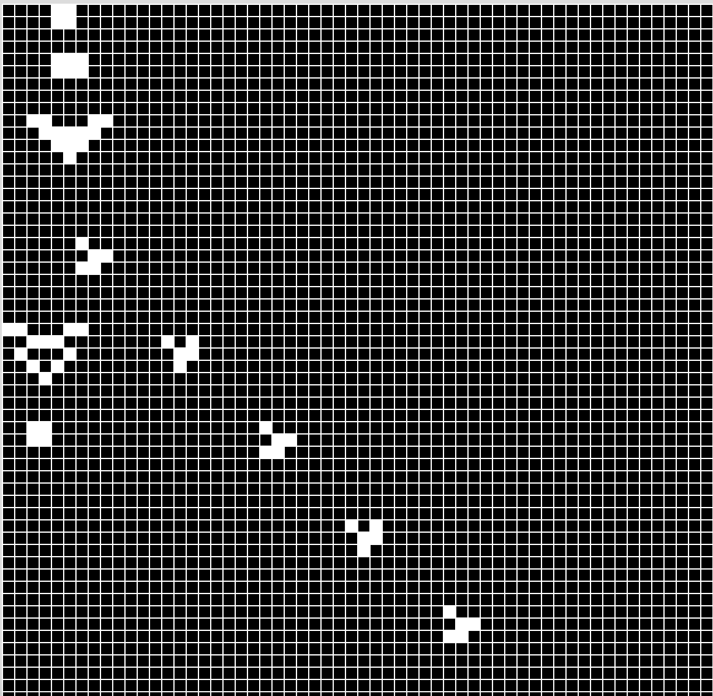

# gameoflife
Conway's "Game of Life" implemented in processing and javascript.

For the javascript implementation, I used the library p5.js, which can be found here: https://p5js.org

TODO:
- [ ] Save output as gif
- [ ] Choose either fixed or periodic boundary conditions in input

